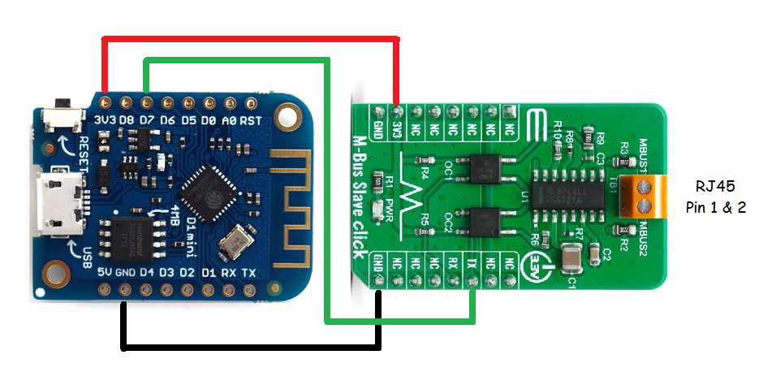

# mbus-test
Orignally designed and coded by [@roarfred](https://github.com/roarfred), see the original repo at [roarfred/AmsToMqttBridge](https://github.com/roarfred/AmsToMqttBridge)
Also updated by [@gskjold](https://github.com/gskjold/AmsToMqttBridge)

This is a minimalistic approach since I failed to use the code above. The serial port only received about 20% of the received characters, but I have not spent time debugging to find out why.

More info about the HAN-port can be found here: [HAN-porten](https://hanporten.se/)

## Software
Needs the following libraries:

- [X] https://github.com/JoaoLopesF/RemoteDebug
- [X] PubSubClient
- [X] ArduinoOTA

RemoteDebug makes it possible to debug the unit remotely. Using e.g. telnet one can get debug output and even send commands to the unit.

## Hardware setup
To simplify the design, a Click-board from MikroE was used to convert the signal sent from the meter to readable characters by the ESP.

